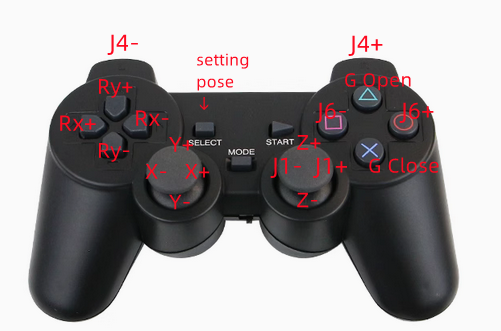

# myCobot_Keyboard_Joystick Control

Provide  expand code for simple teaching with **keyboard control** and **joystick control** for the **myCobot mechArm** series robotic arms. The joystick can be purchased as a basic 2.4G joystick (which can be read using the pygame library).

in 5min after you updating driver follow [base function burn](https://docs.elephantrobotics.com/docs/mycobot_280_m5_en/3-FunctionsAndApplications/5.BasicFunction/5.2-Softwarelnstructions/)

---

## 如何使用 How to use

(Make sure python ==3.8.xx)

```
cd MyCobot_Keyboard_JoyStick_Control
```

```
pip install -r requirements.txt
```

**KeyBoard**：

```
cd KeyBoard
python myCobot_control_by_key.py
```


**JoyStick**：

```
cd JoyStick
python3 handle_control.py
```



## API Details

[MyCobot 280 API说明](./docs/MyCobot_280_zh.md) | [MyCobot 280 API Description](./docs/MyCobot_280_en.md)

[MyCobot 320 API说明](./docs/MyCobot_320_zh.md) | [MyCobot 320 API Description](./docs/MyCobot_320_en.md)

[MechArm 270 API说明](./docs/MechArm_270_zh.md) | [MechArm 270 API Description](./docs/MechArm_270_en.md)

[MyPalletizer 260 API说明](./docs/MyPalletizer_260_zh.md) | [MyPalletizer 260 API Description](./docs/MyPalletizer_260_en.md)

[myAGV API说明](./docs/myAGV_zh.md) | [myAGV API Description](./docs/myAGV_en.md)

[myArm_M&C API说明](./docs/myArm_M&C_zh.md) | [myArm_M&C API Description](./docs/myArm_M&C_en.md)

[ultraArm P340 API说明](./docs/ultraArm_P340_zh.md) | [ultraArm P340 API Description](./docs/ultraArm_P340_en.md)


